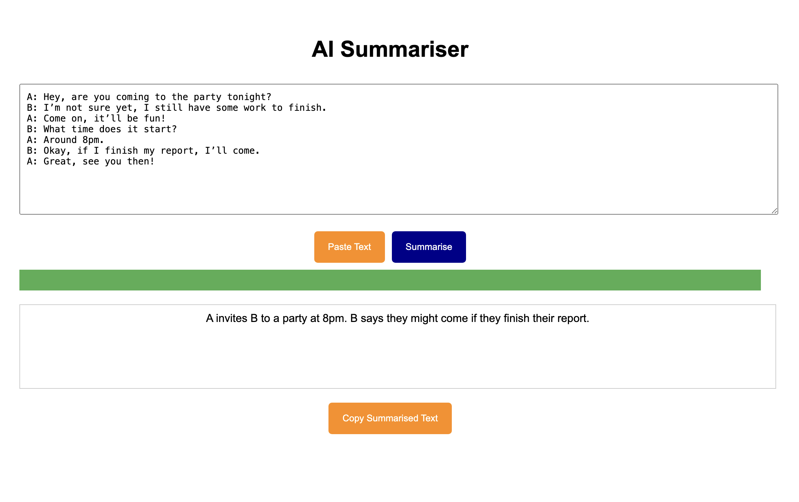

# Text Summarisation
Welcome to the **text summarisation project**! This project walks you through a complete pipeline for summarising text, covering everything from data ingestion to evaluating the final model. We've used **GitHub Actions for CI/CD** and deployed everything on **Azure Cloud** to keep things running smoothly and continuously integrated. The modular design makes it easy to maintain and scale. Plus, we've created a user-friendly **web application** with HTML, CSS, and FastAPI so you can easily input text and get summaries right away.




## Workflows
1. **Update config.yaml**
2. **Update params.yaml**
3. **Update entity**
4. **Update the configuration manager in src config**
5. **update the conponents**
6. **update the pipeline**
7. **update the main.py**
8. **update the app.py**

## Project Architecture
1. **Data Ingestion**:
   - In this step, we handle data preprocessing and data cleaning.

2. **Data Validation**:
   - Ensuring the text data's integrity and correctness.

3. **Data Transformation**:
   - Cleaning and transforming text data into a suitable format for summarisation.

4. **Model Training**:
   - Training machine learning models for text summarisation

5. **Model Evaluation**:
   - Evaluating the performance of the text summarisation models.

6. **Web Interface**:
   - A user-friendly interface for inputting text and displaying summaries.

7. **CI/CD**:
   - Automated testing and deployment using GitHub Actions.

8. **Cloud Deployment**:
   - Deploying the text summarisation model and web interface on Azure Cloud.

## Key Features
- **Modular pipeline structure** 
- **Automated CI/CD pipeline**
- **Scalable and maintainable codebase**
- **Web interface for user interaction**
- **Deployment on Azure Cloud**

## How to Run
**Create a conda environment after opening the repository:**
```bash
conda create -n summary python=3.8 -y
conda activate summary
```
**Install Dependencies:**
```bash
pip install -r requirements.txt
```
**Run the application:**
```bash
python app.py
```
## Azure Deployment Steps:

1. **Prepare Your Environment:** 
-  Log in to Azure Portal
2. **Create and Configure Azure Resources** 
-  Create a Resource Group
```bash
az group create --name <Your Resource Group Name> --location eastus
```
-  Create an Azure Container Registry (ACR)
```bash
az acr create --resource-group <Your Resource Group Name> --name TextSummaryRegistry --sku Basic
```
-  Create an Azure App Service Plan
```bash
az appservice plan create --name <Azure App Service Plan Name> --resource-group <Your Resource Group Name> --sku B1 --is-linux
```
3. **Build and Push Docker Image**

- Build Docker Image
```bash
docker build -t <Your Image Name> .
```
- Tag Docker Image
```bash
docker tag <Your Image Name> <Your ACR Login Server>/<Your Image Name>:latest
```
- Login to ACR
```bash
az acr login --name <Your ACR Name>
```
- Push Docker Image to ACR
```bash
docker push <Your ACR Login Server>/<Your Image Name>:latest
```
4. **Configure Continuous Deployment**

  Set Up GitHub Actions for CI/CD
- Create the workflow file in .github/workflows/main.yml

5. **Set Up GitHub Secrets**

   **ACR_NAME**: The name of your Azure Container Registry.

   **RESOURCE_GROUP**: The name of your Azure resource group.

   **AZURE_CREDENTIALS**: Credentials required to authenticate with Azure.

6. **Deploy and Verify**
- Push your code to the main branch.
- GitHub Actions will automatically build and deploy your Docker image to Azure.
- Verify the deployment by visiting your Azure Web App URL.

## Results
The final output of the project is a trained text summarisation model deployed on Azure Cloud, accessible via a web interface where users can input text and receive summarised content.
